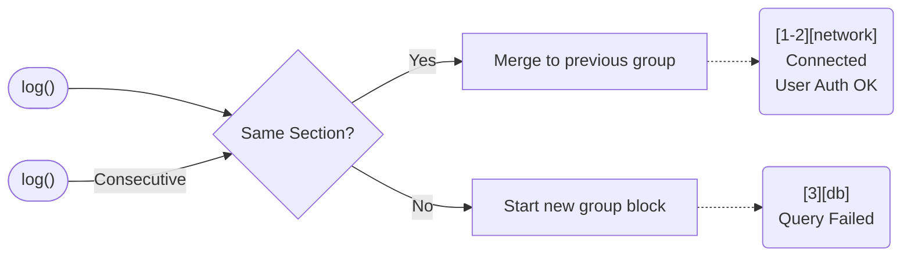
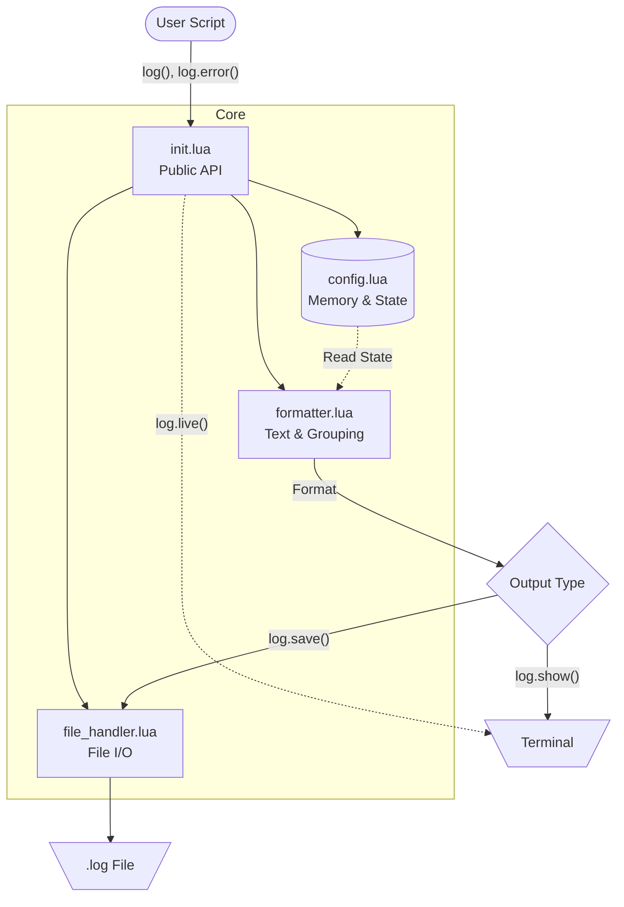

# LogLua

A modular and minimalist logging system for Lua: collect messages in memory, organize by sections/categories, automatically group consecutive messages, monitor in real-time with live mode, display in console and save to files with timestamped headers.

## Features

- **Simple logging** - Add messages with multiple values
- **Section system** - Organize logs by categories
- **Auto grouping** - Consecutive messages from same section are grouped `[1-3][section]`
- **Live Mode** - Monitor logs in real-time
- **Filters** - Display/save only specific sections
- **Debug mode** - Conditional debug messages
- **Error tracking** - Automatic error counter
- **File saving** - Append with timestamps
- **ANSI colors** - Errors in red, debug in yellow
- **Modular architecture** - Well organized code
- **Type definitions** - Full LuaLS (lua-language-server) support with autocomplete

## Installation

```bash
luarocks install loglua
```


## Quick Start

What makes LogLua special is its **stateful grouping**, **section routing**, and lightweight approach. Here is how it shines in practice:

```lua
local log = require("loglua")

-- 1. Auto-grouping: Consecutive messages implicitly group together
log("App started", "v2.0")
log("Loading configurations...")

-- 2. Sections: Tag messages or create dedicated loggers
log.add(log.section("network"), "Connected to database")

local dbLog = log.inSection("database")
dbLog("Query executed successfully")
dbLog("Rows returned:", 42)

-- 3. Conditional Debugging: Zero cost when inactive
log.activateDebugMode()
log.debug("Loaded 42 rows from cache")

-- 4. Error Tracking: Built-in error counter and formatting
log.error("Failed to fetch user data")

-- 5. Execution: Show accumulated logs with stats, or monitor in real-time
log.show() 
-- log.live() -- Uncomment to enable real-time printing!
```

Example output, showing the automatic indexing `[1-2]`, sections `[database]`, counters, and the summary footer:

```text
-=-=-=-=-=-=-=-=-=-=-=-=-=-=-=-=-=-=-=-=-=
--  Tue Nov 25 14:30:00 2025  --
-=-=-=-=-=-=-=-=-=-=-=-=-=-=-=-=-=-=-=-=-=

[1-2][general]
 App started v2.0
 Loading configurations...

[3][network]
 Connected to database

[4-5][database]
 Query executed successfully
 Rows returned: 42

[6][general]__
 Loaded 42 rows from cache

[7][general]
////--error: Failed to fetch user data

Total prints:  7
Total errors:  1
Sections:  general, network, database
```

## Flow & Grouping Logic

LogLua handles consecutive identical sections seamlessly, making your logs less noisy. If `live()` is active, it detects these repetitions dynamically during printing.



## Documentation

For detailed information about LogLua's features and API, please refer to the documentation:

- [Complete API Reference](docs/api.md)
- [Section System](docs/sections.md)
- [Live Mode](docs/live_mode.md)
- [Formatting, Colors & Grouping](docs/formatting.md)
- [Advanced Examples](docs/examples.md)

## Project Structure

```text
loglua/
├── init.lua           # Main module (public API)
├── config.lua         # Configuration and state (messages, debug, counters)
├── formatter.lua      # Message and header formatting
├── file_handler.lua   # File operations (I/O)
├── help.lua           # Built-in help system
├── constants/
│   ├── ANSIColors.lua # ANSI color constants
│   └── helper/        # Help page contents by language
│       └── en/
└── utils/
    └── formatIndex.lua # Index formatting utility

library/               # Type definitions (LuaLS / lua-language-server)
├── loglua.lua         # Public API definitions (logluaLib)
├── config.lua         # Config module definitions (loglua.configLib)
├── formatter.lua      # Formatter module definitions
└── help.lua           # Help module definitions

spec/
└── loglua_spec.lua    # Automated tests (busted)

rockspecs/             # Rockspecs for LuaRocks publishing
```

### Architecture

LogLua uses a modular structure to separate formatting, state, and file operations.



- **`init.lua`**: Public API, integrates all modules
- **`config.lua`**: Manages internal state (messages, sections, counters)
- **`formatter.lua`**: Text formatting (headers, messages, separators)
- **`file_handler.lua`**: File I/O operations
- **`help.lua`**: Built-in documentation accessible via `log.help()`
- **`library/`**: Type definitions for LuaLS autocomplete and type-checking

## Notes

- Messages stay in memory until cleared with `clear()`
- Calling `save` repeatedly appends to file (with new timestamp)
- Debug messages are silently ignored if `debugMode` is inactive (no performance cost)
- Sections are automatically registered when adding messages
- Type definitions in `library/` provide full autocomplete in LuaLS-compatible editors

## Compatibility

- Lua >= 5.4
- LuaRocks for distribution

## License

MIT — see `LICENSE`.
