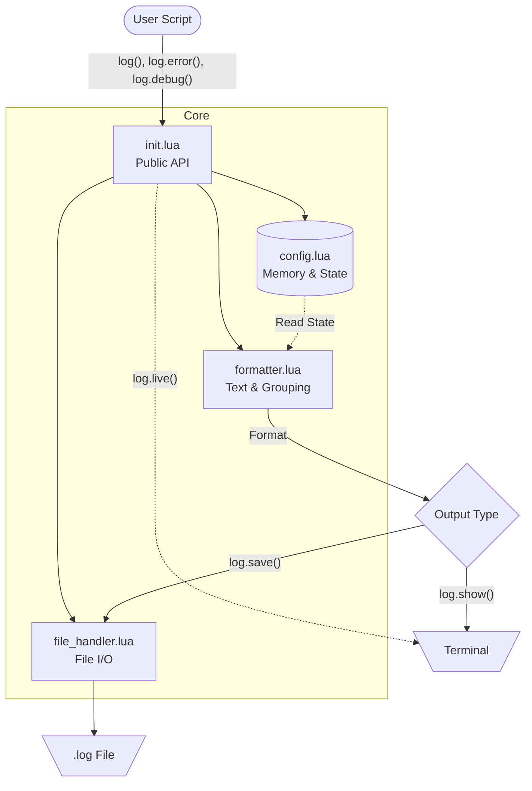

# Complete API

### Basic Logging

| Function | Description |
|--------|-----------|
| `log(...)` | Shortcut for `log.add(...)` |
| `log.add(...)` | Adds log message |
| `log.debug(...)` | Adds debug message (requires `debugMode`, returns immediately if inactive) |
| `log.error(...)` | Adds error message (increments counter) |

### Sections

| Function | Description |
|--------|-----------|
| `log.section(name)` | Creates section tag to use in add/debug/error |
| `log.inSection(name)` | Returns object with pre-configured add/debug/error |
| `log.setDefaultSection(name)` | Sets default section for new messages |
| `log.getDefaultSection()` | Returns current default section name |
| `log.getSections()` | Returns list of all used sections |

### Display and Saving

| Function | Description |
|--------|-----------|
| `log.show([filter])` | Displays logs in console (optional filter) |
| `log.save([dir], [name], [filter])` | Saves logs to file (optional filter) |

### Live Mode

| Function | Description |
|--------|-----------|
| `log.live()` | Activates live mode (real-time) |
| `log.unlive()` | Deactivates live mode |
| `log.isLive()` | Checks if live mode is active |

### Colors

| Function | Description |
|--------|-----------|
| `log.enableColors()` | Enables ANSI colors |
| `log.disableColors()` | Disables ANSI colors |
| `log.hasColors()` | Checks if colors are enabled |

### Configuration

| Function | Description |
|--------|-----------|
| `log.activateDebugMode()` | Activates debug mode |
| `log.deactivateDebugMode()` | Deactivates debug mode |
| `log.checkDebugMode()` | Checks if debug mode is active |
| `log.setHandlerHeader(func)` | Sets custom header handler function |
| `log.clear()` | Clears all messages and resets counters |

### Help

| Function | Description |
|--------|-----------|
| `log.help()` | Displays general help |
| `log.help("SectionSystem")` | Help about section system |
| `log.help("LiveMode")` | Help about live mode |
| `log.help("CompleteAPI")` | Complete API list |

## 📋 Notes

- Messages stay in memory until cleared with `clear()`
- Calling `save` repeatedly appends to file (with new timestamp)
- Debug messages are silently ignored if `debugMode` is inactive (no performance cost)
- Sections are automatically registered when adding messages
- Type definitions in `library/` provide full autocomplete in LuaLS-compatible editors