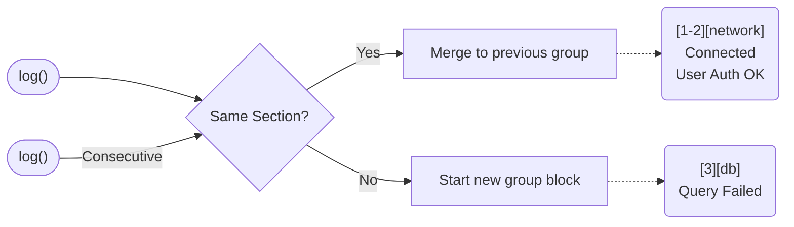

# Formatting, Colors, and Grouping

## 📦 Auto Grouping

Consecutive messages from the same section are automatically grouped for better readability. The visual grouping behaves natively based on log sequences without needing any extra intervention.



```lua
local net = log.inSection("network")
net("Connecting...")
net("Handshake OK")
net("Authenticated")

log.add(log.section("database"), "Query executed")

net("Sending data")
net("Response received")
```

Output:

```text
[1-3][network]
 Connecting...
 Handshake OK
 Authenticated

[4][database]
 Query executed

[5-6][network]
 Sending data
 Response received
```

## 🎨 Colors

Enable ANSI colors for colored output (errors in red, debug in yellow):

```lua
log.enableColors()   -- enable colors
log.disableColors()  -- disable colors
log.hasColors()      -- check if colors are enabled
```

## 🔧 Custom Header

Customize the log header with `setHandlerHeader`:

```lua
log.setHandlerHeader(function()
    return "(-/", 9, "My App"
end)
```

Output:

```text
(-/(-/(-/(-/(-/(-/(-/(-/(-/(-/
My App
(-/(-/(-/(-/(-/(-/(-/(-/(-/(-/
```