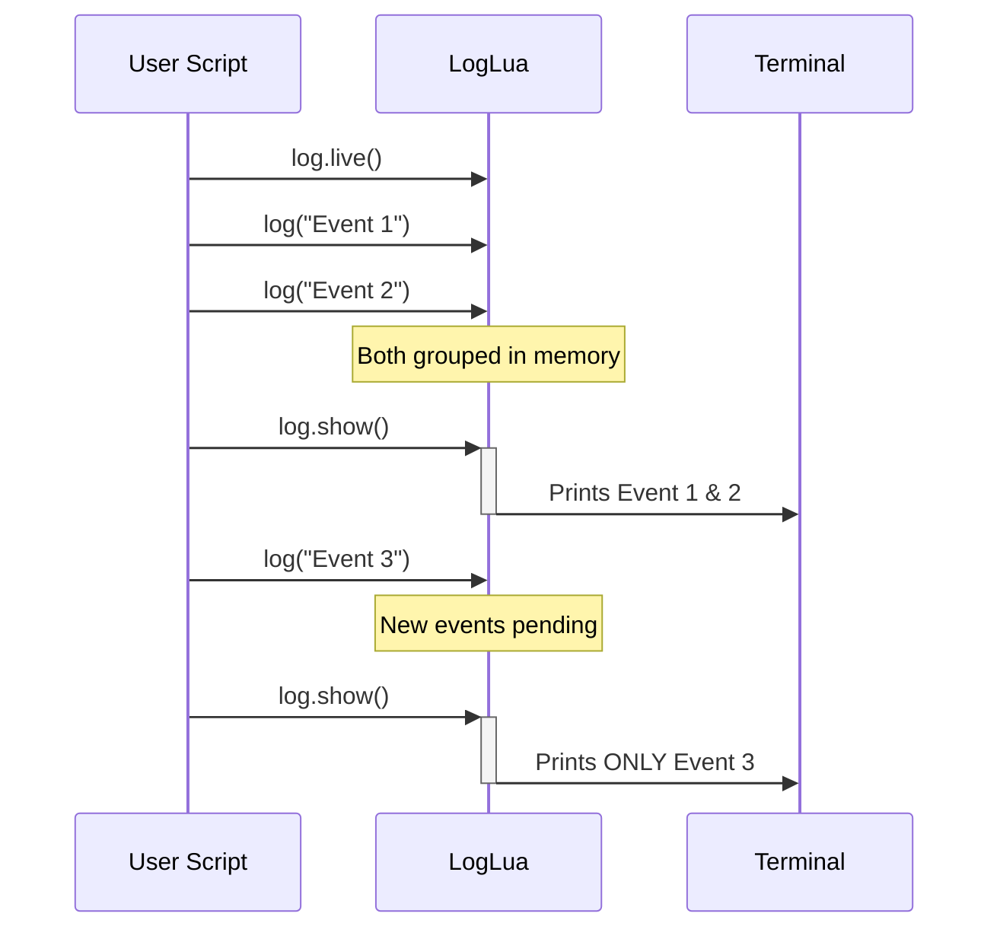

# Live Mode (Real-Time)

Live mode allows monitoring logs in real-time, displaying only new messages since the last `log.show()` call.



### Activating and deactivating

```lua
log.live()      -- activate live mode
log.unlive()    -- deactivate live mode
log.isLive()    -- returns true if live mode is active
```

### Monitoring example

```lua
local log = require("loglua")

-- Activate live mode
log.live()

-- Simulate running application
for i = 1, 10 do
    log("Event " .. i)
    
    if i % 3 == 0 then
        log.show()  -- shows only new logs (last 3)
    end
end

log.unlive()  -- back to normal mode
log.show()    -- now shows all logs with header
```

### Continuous monitoring

```lua
log.live()

local running = true
while running do
    -- your code that generates logs...
    processEvents()
    
    log.show()  -- shows only new messages
    sleep(1)
end
```

### Live mode with filters

```lua
log.live()

-- Monitor only network logs
log.show("network")

-- Or multiple sections
log.show({"network", "database"})
```

### Behavior

| Mode | `log.show()` behavior |
|------|------------------------------|
| Normal | Displays all messages with header and statistics |
| Live | Displays only new messages since last call |